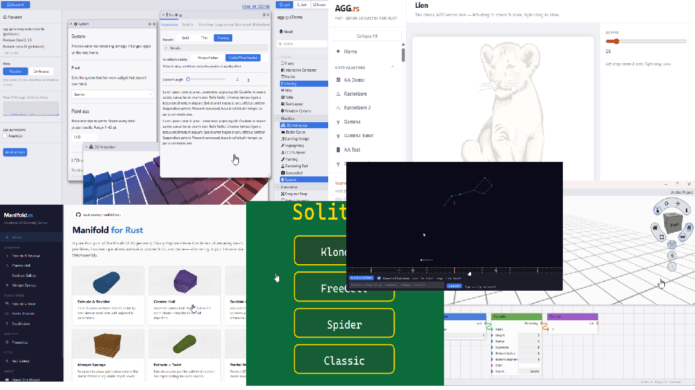

# Rust Apps

[](https://larsbrubaker.github.io/rust-apps/)

A curated suite of Rust libraries and applications by Lars Brubaker, bundled together as Git submodules so you can clone, build, and update them in one shot.

The stack works from the bottom up: low-level geometry and physics libraries (clipper2-rust, tess2-rust, manifold-rust, box2d-rust, box3d-rust) feed into the AGG-based rendering core (agg-rust + agg-gui), which in turn powers the end-user apps (atomartist, antidote, solitaire, instant-astronomer, Thingi10K). Everything is pure Rust, runs natively on Windows / macOS / Linux, and most of the apps also build to WebAssembly so you can try them in a browser without installing anything.

[**Live stats dashboard**](https://larsbrubaker.github.io/rust-apps/) — stars, forks, watchers, open issues, and open PRs for every repo in the suite, refreshed daily via GitHub Pages.

## Clone with all submodules

```bash
git clone --recurse-submodules https://github.com/larsbrubaker/rust-apps.git
```

To update all submodules to their latest commits:

```bash
git submodule update --remote --merge
```

---

## Support the Project

<a href="https://buymeacoffee.com/larsbrubaker"></a>

This project — and the libraries and apps it bundles — is open-source and free to use, maintained in spare time as a labor of love. Friends James Smith and Dan Ruskin help out from time to time too.

If you find it useful, here are a few ways to help keep development going:

- **Donations:** [Buy Me a Coffee](https://buymeacoffee.com/larsbrubaker) — every coffee helps.
- **Star the repo:** Costs nothing and helps others find the project.
- **Report issues:** [Open an issue](https://github.com/larsbrubaker/rust-apps/issues) for bugs or feature ideas.
- **Contribute:** PRs welcome — open an issue first to discuss larger changes.

---

## Repositories

### [clipper2-rust](https://github.com/larsbrubaker/clipper2-rust)

Complete, pure Rust port of the [Clipper2 C++ library](https://github.com/AngusJohnson/Clipper2) by Angus Johnson — polygon clipping and offsetting with support for union, intersection, difference, and XOR operations.

[](https://larsbrubaker.github.io/clipper2-rust/)

[Live Demo](https://larsbrubaker.github.io/clipper2-rust/) · [Repository](https://github.com/larsbrubaker/clipper2-rust)

---

### [box2d-rust](https://github.com/larsbrubaker/box2d-rust)

Pure Rust port (in progress) of [Box2D v3](https://github.com/erincatto/box2d) by Erin Catto — the 2D physics engine, ported module by module with exact behavioral matching, including its cross-platform deterministic math. Full `b2World_Step` simulation is running; interactive wasm demos mirror the upstream samples app.

[](https://larsbrubaker.github.io/box2d-rust/)

[Live Demo](https://larsbrubaker.github.io/box2d-rust/) · [Repository](https://github.com/larsbrubaker/box2d-rust) · [crates.io](https://crates.io/crates/box2d-rust)

---

### [box3d-rust](https://github.com/larsbrubaker/box3d-rust)

Pure Rust port (just started) of [Box3D](https://github.com/erincatto/box3d) by Erin Catto — the new 3D physics engine released in June 2026, ported module by module with exact behavioral matching following the same playbook as box2d-rust.

[](https://larsbrubaker.github.io/box3d-rust/)

[Live Demo](https://larsbrubaker.github.io/box3d-rust/) · [Repository](https://github.com/larsbrubaker/box3d-rust) · [crates.io](https://crates.io/crates/box3d-rust)

---

### [tess2-rust](https://github.com/larsbrubaker/tess2-rust)

Pure Rust port of [libtess2](https://github.com/memononen/libtess2) — the SGI tessellation library for converting complex polygons (including self-intersecting and with holes) into triangles.

[](https://larsbrubaker.github.io/tess2-rust/)

[Live Demo](https://larsbrubaker.github.io/tess2-rust/) · [Repository](https://github.com/larsbrubaker/tess2-rust)

---

### [agg-rust](https://github.com/larsbrubaker/agg-rust)

Pure Rust port of [Anti-Grain Geometry (AGG) 2.6](http://www.antigrain.com/) — a high-quality 2D vector graphics rendering engine with sub-pixel accuracy and anti-aliasing.

[](https://larsbrubaker.github.io/agg-rust/)

[Live Demo](https://larsbrubaker.github.io/agg-rust/) · [Repository](https://github.com/larsbrubaker/agg-rust)

---

### [agg-gui](https://github.com/larsbrubaker/agg-gui)

A Rust GUI framework built on top of [agg-rust](https://github.com/larsbrubaker/agg-rust) — provides widgets, layout, and rendering for desktop applications using AGG as the rendering backend.  Immediate-mode widget tree, Y-up coordinates, halo-AA GL pipeline, multi-touch support.

[](https://larsbrubaker.github.io/agg-gui/)

[](https://crates.io/crates/agg-gui) · [Live Demo](https://larsbrubaker.github.io/agg-gui/) · [Repository](https://github.com/larsbrubaker/agg-gui)

---

### [manifold-rust](https://github.com/larsbrubaker/manifold-rust)

Pure Rust port of the [Manifold](https://github.com/elalish/manifold) 3D geometry library — fast, robust, watertight boolean operations on triangle meshes.

[](https://larsbrubaker.github.io/manifold-rust/)

[Live Demo](https://larsbrubaker.github.io/manifold-rust/) · [Repository](https://github.com/larsbrubaker/manifold-rust)

---

### [Thingi10K](https://github.com/larsbrubaker/Thingi10K)

Searchable 3D model archive browser for the [Thingi10K dataset](https://ten-thousand-models.appspot.com/) — 10,000 Thingiverse models with mesh quality metadata. Built with Rust/WASM.

[](https://larsbrubaker.github.io/Thingi10K/)

[Live Demo](https://larsbrubaker.github.io/Thingi10K/) · [Repository](https://github.com/larsbrubaker/Thingi10K)

---

### [atomartist](https://github.com/larsbrubaker/atomartist)

Visual node-based 3D design tool in pure Rust. Wire together typed nodes — primitives, transforms, boolean operations, extrusions, imported meshes — and watch the resulting 3D geometry update live in the viewport. Built on [agg-gui](https://github.com/larsbrubaker/agg-gui), [manifold-rust](https://github.com/larsbrubaker/manifold-rust), [clipper2-rust](https://github.com/larsbrubaker/clipper2-rust), and [tess2-rust](https://github.com/larsbrubaker/tess2-rust). Runs natively (Windows / macOS / Linux) and in the browser (WASM via WebGPU / WebGL2).

[](https://larsbrubaker.github.io/atomartist/)

[Live Demo](https://larsbrubaker.github.io/atomartist/) · [Repository](https://github.com/larsbrubaker/atomartist)

---

### [antidote](https://github.com/larsbrubaker/antidote)

Bubble-trap virus puzzle game in Rust — rendered with [agg-gui](https://github.com/larsbrubaker/agg-gui), physics by [rapier2d](https://rapier.rs/), persisted to a multi-game Supabase Postgres backend. Runs natively (winit + wgpu) and in the browser (WebAssembly).

[](https://larsbrubaker.github.io/antidote/)

[Live Demo](https://larsbrubaker.github.io/antidote/) · [Repository](https://github.com/larsbrubaker/antidote)

---

### [solitaire](https://github.com/larsbrubaker/solitaire)

Four solitaire variants in Rust — Klondike, FreeCell, Spider, and Microsoft-style Classic. Rendered with [agg-gui](https://github.com/larsbrubaker/agg-gui), persisted to the same Supabase backend as antidote. Runs natively (winit + wgpu) and in the browser (WebAssembly).

[](https://larsbrubaker.github.io/solitaire/)

[Live Demo](https://larsbrubaker.github.io/solitaire/) · [Repository](https://github.com/larsbrubaker/solitaire)

---

### [instant-astronomer](https://github.com/larsbrubaker/instant-astronomer)

Point your phone at the sky and see what you're looking at — stars, planets, the Sun, the Moon, constellations, all driven by your location, the current time, and (on mobile) the device's compass + IMU. Tap any bright object to identify it: "that's Venus, magnitude −4.4." Rendered entirely through [agg-gui](https://github.com/larsbrubaker/agg-gui) — no separate WebGL / wgpu 3-D pipeline. Runs natively (winit + wgpu) and in the browser (WebAssembly).

[](https://larsbrubaker.github.io/instant-astronomer/)

[Live Demo](https://larsbrubaker.github.io/instant-astronomer/) · [Repository](https://github.com/larsbrubaker/instant-astronomer)
